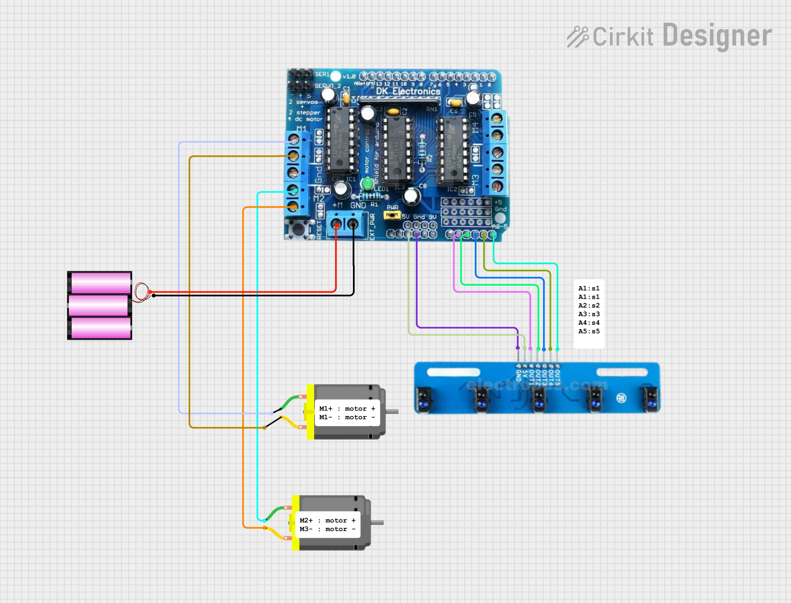

# Line Follower Robot

This project implements a line follower robot using Arduino and an array of infrared (IR) sensors. The robot uses PID (Proportional, Integral, Derivative) control to follow a line effectively while maintaining a high-speed performance, allowing for sharp turns without losing the path.

## Features
- **PID Control:** The robot adjusts its speed based on the position of the line detected by the sensors.
- **Calibration:** The sensors are calibrated to adapt to different surfaces, ensuring reliable line detection.
- **Sharp Turn Adjustment:** The robot can handle sharp turns by adjusting the speed of the motors independently.

## Components
- Arduino Board
- L2983D Shield (need to solder the male headers in the required wholes )
- 5-channel IR sensor array
- DC motors
- Chassis for the robot

## Circuit Diagram

## Setup Instructions
1. Connect the IR sensors to the analog pins of the Arduino as defined in the code.
2. Connect the motors to the motor shield ports.
3. Upload the provided code to your Arduino [code](efficentcode.ino)
.
4. Calibrate the sensors by moving them over both black and white surfaces before running the robot.

## Code Overview
The main components of the code include:
- **Sensor Calibration:** Adjusts the minimum and maximum sensor values for accurate readings.
- **Sensor Reading:** Continuously checks the sensor values to determine the robot's position relative to the line.
- **PID Control Logic:** Calculates motor speeds based on the error in the robot's position to maintain its path.
- **Motor Control:** Adjusts the speed and direction of the motors based on the sensor readings and PID calculations.

## Usage
After uploading the code and calibrating the sensors, place the robot on a track with a clear line (black on a white surface) and observe its performance. Adjust the PID constants if needed to fine-tune the robot's response.

## License
This project is licensed under the MIT License.
