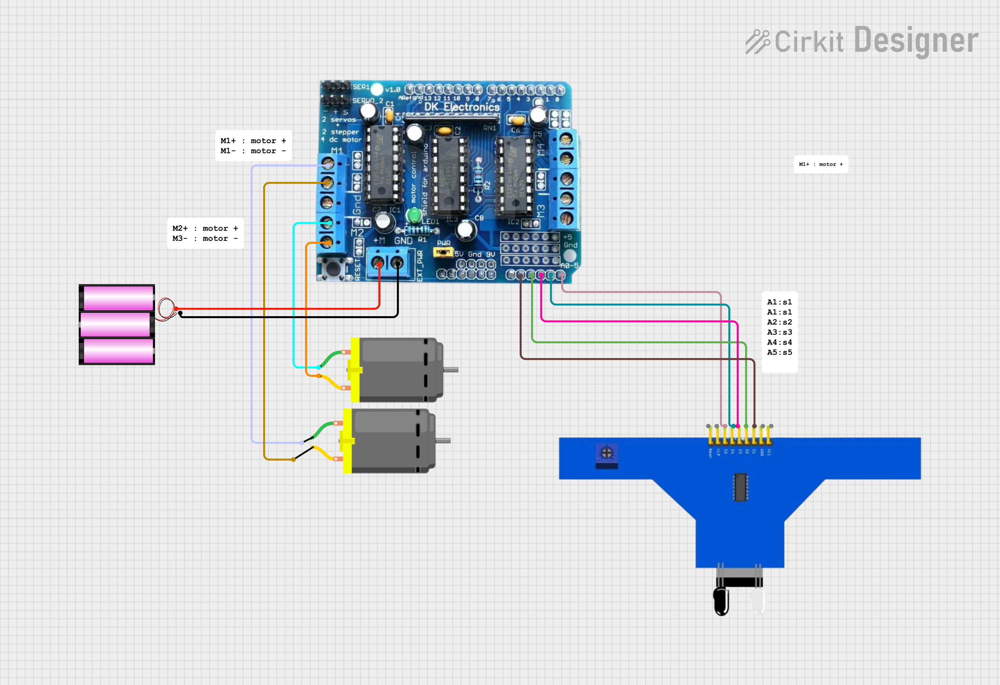

# Line Follower Robot Project

This project is a line follower robot using an Arduino Uno, L293D motor driver shield, and a 5-channel IR sensor array. The robot follows a black line on a white surface using PID control for smooth movement and high-speed turns.

## Components

- Arduino Uno
- L293D Motor Driver Shield
- 5-Channel IR Sensor Array
- Jumper Wires
- Chassis
- Wheels
- Geared Motors
- Acrylic Sheet (for sensor mounting)

## Project Overview

This robot reads line position data from a 5-channel IR sensor array, calculates the line position error, and uses PID control to adjust motor speeds. This allows the robot to make accurate, high-speed turns while following a black line on a white background. The motor driver shield is used to control two DC motors attached to the left and right wheels.

## Code Explanation

The code is structured as follows:

1. **Setup and Initialization**: Initializes motors and calibrates sensors to adapt to different lighting conditions and surface reflectivity.
2. **Sensor Calibration**: Reads and stores minimum and maximum values for each sensor, enabling normalized line detection.
3. **Error Calculation**: Calculates the position error using weighted averages based on sensor data.
4. **PID Control**: Uses a proportional-integral-derivative (PID) controller to calculate the correction based on the error. Adjusts motor speeds for accurate line tracking.
5. **All-Sensors White Detection**: Stops the robot if all sensors detect white (indicating that it is off the line).

## How It Works

1. **Calibration**: Move the robot over both black and white areas during setup to allow it to detect contrast effectively.
2. **Line Following**: The robot continuously reads from the IR sensors to detect the black line and adjusts motor speeds using the PID control loop.

## Circuit Diagram


### Connections
- **Motor Driver Shield**: 
  - Left Motor connected to Motor 1 (M1)
  - Right Motor connected to Motor 2 (M2)
- **IR Sensor Array**:
  - Each of the 5 IR sensors is connected to analog pins (A0 to A4) on the Arduino.

## Code

```cpp
#include <AFMotor.h>

// Define the number of sensors
#define NUM_SENSORS 5

// Define sensor pins
const uint8_t sensorPins[NUM_SENSORS] = {A0, A1, A2, A3, A4};

// Arrays for calibration and sensor readings
uint16_t sensorMin[NUM_SENSORS];
uint16_t sensorMax[NUM_SENSORS];
uint16_t sensorValues[NUM_SENSORS];

// Motors connected to motor shield
AF_DCMotor leftMotor(1);  // M1
AF_DCMotor rightMotor(2); // M2

// PID constants and control variables
int baseSpeed = 80;
int maxSpeed = 150;
float Kp = 0.5;
float Ki = 0.0;
float Kd = 1.0;
int lastError = 0;
int integral = 0;

void setup() {
    Serial.begin(9600);
    leftMotor.setSpeed(0);
    rightMotor.setSpeed(0);
    leftMotor.run(FORWARD);
    rightMotor.run(FORWARD);
    calibrateSensors();
}

void loop() {
    if (allSensorsWhite()) {
        stopMotors();
    } else {
        readSensors();
        PID_control();
    }
    delay(50);
}

// Calibration, Sensor Reading, Error Calculation, PID, and Motor Speed functions...
```
# Line Follower Robot with PID Control

This project is a line follower robot using an Arduino Uno and an IR sensor array. The robot uses a PID (Proportional-Integral-Derivative) algorithm to stay on track by adjusting the motor speeds according to sensor readings.

## Usage

1. **Upload the code** to your Arduino Uno.
2. **Place the robot** on a line and observe as it follows the path.
3. **Adjust PID constants** (Kp, Ki, Kd) and motor speeds as needed for optimal performance.

## PID Tuning

- **Kp (Proportional gain)**: Controls the speed of correction. If too high, the robot may oscillate; if too low, it may respond slowly.
- **Ki (Integral gain)**: Helps to reduce steady-state error. Increasing Ki can help the robot stay on track if it drifts.
- **Kd (Derivative gain)**: Reduces overshoot by dampening the correction speed.

## Troubleshooting

- **Robot doesn't follow the line**: Try recalibrating by adjusting sensor thresholds or test on a different surface.
- **Robot oscillates or veers off track**: Tune the Kp, Ki, and Kd constants to improve responsiveness and reduce oscillations.
- **Stops unexpectedly**: Check all connections, especially the IR sensor array, and ensure a stable power supply to the motors.

## License

This project is open-source. Feel free to modify and adapt it for educational and personal use.

---


